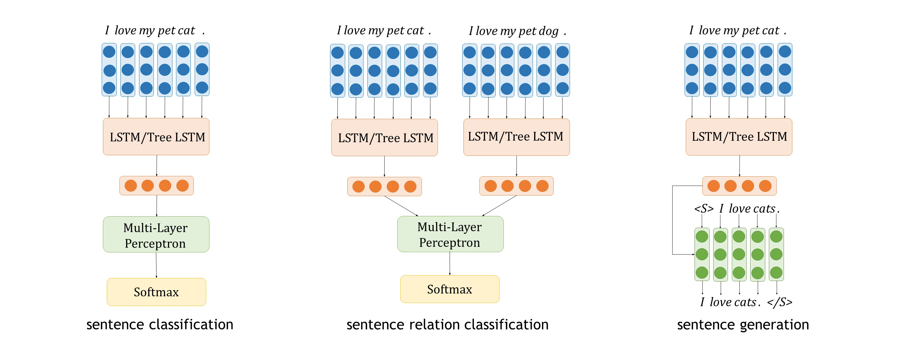

# On Tree-Based Neural Sentence Modeling

This repo includes the implementation of our paper "On Tree-Based Neural Sentence Modeling" at EMNLP 2018 [1].

Developed by [Haoyue (Freda) Shi](http://explorerfreda.github.io), [Hao Zhou](http://zhouh.github.io) and Jiaze Chen.

## Overview



We study the problem of sentence encoding on various downstream tasks, which can be grouped into three categories: 
sentence classification, sentence relation classification and sentence generation. 

Our investigated sentence encoders are: (bi-)LSTMs, (binary) constituency tree LSTMs, balanced tree LSTMs, 
fully left-branching tree LSTMs, fully right-branching tree LSTMs. The last three are trivial trees containing no 
syntactic information. We also support bidirectional leaf RNN (LSTM) for tree-based encoders.


We get the following surprising conclusions:
1. Trivial tree encoders get competitive or even better results on all the investigated tasks. 
2. Further analysis show that tree modeling gives better results when crucial words are closer to the final 
representation.


## Datasets

We evaluate the models in the following ten datasets, of which the metadata are summarized in the following table. 

<table>
  <tr>
    <th>Dataset</th>
    <th>#Train</th>
    <th>#Dev</th>
    <th>#Test</th>
    <th>#Class</th>
    <th>Avg. Length</th>
  </tr>
  <tr>
    <td colspan="6">Sentence Classification</td>
  </tr>
  <tr>
    <td>AG News</td>
    <td align="right">60K</td>
    <td align="right">6.7K</td>
    <td align="right">4.3K</td>
    <td align="right">4</td>
    <td align="right">31.5</td>
  </tr>
  <tr>
    <td>Amazon Review Polarity</td>
    <td align="right">128K</td>
    <td align="right">14K</td>
    <td align="right">16K</td>
    <td align="right">2</td>
    <td align="right">33.7</td>
  </tr>
  <tr>
    <td>Amazon Review Full</td>
    <td align="right">110K</td>
    <td align="right">12K</td>
    <td align="right">27K</td>
    <td align="right">5</td>
    <td align="right">33.8</td>
  </tr>
  <tr>
    <td>DBpedia</td>
    <td align="right">106K</td>
    <td align="right">11K</td>
    <td align="right">15K</td>
    <td align="right">14</td>
    <td align="right">20.1</td>
  </tr>
  <tr>
    <td>Word-Level Semantic Relation</td>
    <td align="right">7.1K</td>
    <td align="right">891</td>
    <td align="right">2.7K</td>
    <td align="right">10</td>
    <td align="right">23.1</td>
  </tr>
  <tr>
    <td colspan="6">Sentence Relation Classification</td>
  </tr>
  <tr>
    <td>SNLI</td>
    <td align="right">550K</td>
    <td align="right">10K</td>
    <td align="right">10K</td>
    <td align="right">3</td>
    <td align="right">11.2</td>
  </tr>
  <tr>
    <td>Conjunction Prediction</td>
    <td align="right">552K</td>
    <td align="right">10K</td>
    <td align="right">10K</td>
    <td align="right">9</td>
    <td align="right">23.3</td>
  </tr>
  <tr>
    <td colspan="6"><span style="font-style:italic">Sentence Generation</span></td>
  </tr>
  <tr>
    <td>Paraphrasing</td>
    <td align="right">98K</td>
    <td align="right">2K</td>
    <td align="right">3K</td>
    <td align="right">N/A</td>
    <td align="right">10.2</td>
  </tr>
  <tr>
    <td>Machine Translation</td>
    <td align="right">1.2M</td>
    <td align="right">20K</td>
    <td align="right">80K</td>
    <td align="right">N/A</td>
    <td align="right">34.1</td>
  </tr>
  <tr>
    <td>Autoencoder</td>
    <td align="right">1.2M</td>
    <td align="right">20K</td>
    <td align="right">80K</td>
    <td align="right">N/A</td>
    <td align="right">34.1</td>
  </tr>
</table>


We provide a sample of our data format at ``data/``.
Please [contact Freda](mailto:freda@ttic.edu) if you need a copy of our experimental datasets. The copyrights
are held by the original authors.  


## Requirements
* Python 3
* PyTorch 0.3.0

## Run the Code

### Preliminaries
1. Tokenize and parse sentences using [ZPar](https://www.sutd.edu.sg/cmsresource/faculty/yuezhang/zpar.html) [3].
2. Put data to ``data/``. Our data is in json, *e.g.*, ``data/dbpedia_train.json``. Please refer to our examples and 
[instruction](data/data-instruction.md) for more details.
3. Put vocabularies to ``vocab/``, which is a list of words for each task.

### Train Models

We just introduce some important options here. For adjusting more detailed ones (like learning rate), please refer to
 our code. It should be very easy to find and understand. 

#### Sentence Classification 
```
python3 -m src.train_classification \
    --encoder-type $ENCODER_TYPE \
    --data-prefix data/$TASK_NAME \
    --vocab-path vocab/$TASK_NAME.vocab \
    --num-classes $NUM_CLASSES \
    --save-dir models/$TASK_NAME \
    --pooling $POOLING_METHOD
```

``$ENCODER_TYPE`` can be ``lstm``, ``parsing`` (for binary parsing tree based LSTM [4]), ``gumbel`` (for Gumbel 
Softmax based latent tree learning [2]), ``balanced`` (for balanced tree LSTM), ``left`` (for left-branching tree 
LSTM), ``right`` (for right-branching tree LSTM). Code for Gumbel softmax based latent tree learning is adapted from 
https://github.com/jihunchoi/unsupervised-treelstm.  

``--pooling`` is optional (default ``None``), which can also be ``attention``, ``mean``, ``max`` pooling mechanisms. 
Please refer to our paper for details. 

Example (run balanced tree encoder on DBpedia dataset): 
```
python3 -m src.train_classification \
    --encoder-type balanced \
    --data-prefix data/$TASK_NAME \
    --vocab-path vocab/$TASK_NAME.vocab \
    --num-classes $NUM_CLASSES \
    --save-dir models/$TASK_NAME \
```

If you would like to train a bi-LSTM or tree LSTM with bidirectional leaf RNN, please add ``--bidirectional`` or 
``--bidirectional --leaf-rnn`` to the command. 

#### Sentence Relation Classification
```
python3 -m src.train_sentrel_classification \
    --encoder-type $ENCODER_TYPE \
    --data-prefix data/$TASK_NAME \
    --vocab-path vocab/$TASK_NAME.vocab \
    --num-classes $NUM_CLASSES \
    --save-dir models/$TASK_NAME 
```
which is roughly the same to sentence classification. 

#### Sentence Generation
```
python3 -m src.train_genration \
    --encoder-type $ENCODER_TYPE \
    --data-prefix data/$TASK_NAME \
    --src-vocab-path vocab/$TASK_NAME_SOURCE.vocab \
    --tgt-vocab-path vocab/$TASK_NAME_TARGET.vocab \
    --save-dir models/$TASK_NAME 
```

## Cite TreeEnc
If you find our code useful, please consider citing
```
@inproceedings{shi2018tree,
    title={On Tree-Based Neural Sentence Modeling},
    author={Shi, Haoyue and Zhou, Hao and Chen, Jiaze and Li, Lei},
    booktitle={Proceedings of the Conference on Empirical Methods in Natural Language Processing},
    year={2018}
}
```

 


## References
[1] Haoyue Shi, Hao Zhou, Jiaze Chen, Lei li. 2018. On Tree-Based Neural Sentence Modeling. In *Proc. of EMNLP*.

[2] Jihun Choi, Kang Min Yoo, Sang-goo Lee. 2018. Learning to Compose Task-Specific Tree Structures. In *Proc. of AAAI*. 

[3] Yue Zhang and Stephen Clark. 2011. Syntactic Processing using the Generalized Perceptron and Beam Search. *Computational Linguistics*.

[4] Richard Socher, Alex Perelygin, Jean Wu, Jason Chuang, Christopher D. Manning, Andrew Ng, and Christopher Potts. 2013. Recursive Deep Models for Semantic Compositionality over a Sentiment Treebank. In *Proc. of EMNLP*.
